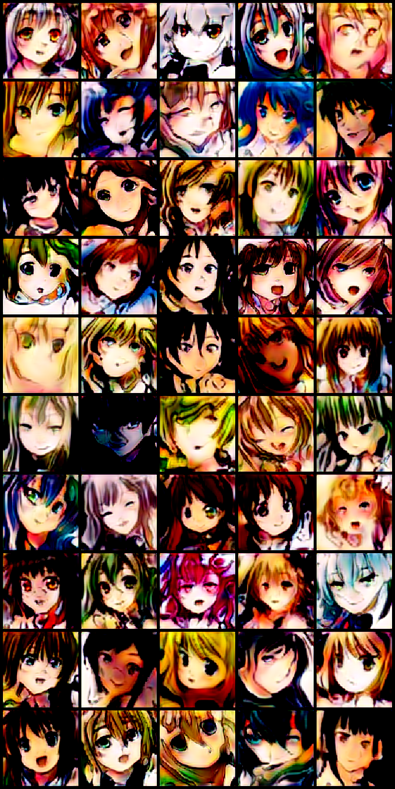
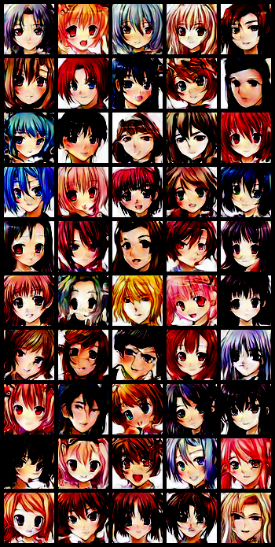

# PGGAN PyTorch Implementation

## Needed setup
Currently, this only supports Python3 . If you have it and PyTorch installed, you are good to go. Just run:

```
python3 trainer.py
```

## Differences with the [original paper](https://arxiv.org/abs/1710.10196)

I tried to keep it as close as possible to the original. However, since I ran in a data sample
with lower resolutions, I changed the default number of channels in each convolutional block, the 
length of the latent vector, and the number of images shown per stable/fading stage. These
can be easily configured by either modifying the config.py file, or by adding the next flags to the
script call:

``` shell
--fmapBase 8192 --fmapMax 512 --fmapDecay 1 --samplesWhileStable 800000 --samplesWhileFade 800000 --endRes 1024 --latentSize 512 --nCritPerGen 1 --stdDevGroup 4
```

I also increased the batch sizes for each resolution. If you want to change them back, modify the corresponding dictionary
in the dataLoader.py file.

I am not really sure how exactly the weights normalization is performed, and reviewing multiple implementations, everyone seems
to have their own idea on how to do it. I tried to review the [original code](https://github.com/tkarras/progressive_growing_of_gans), 
but it is rather obscure. Anyhow, in this implementation, the weights for each channel in a convolutional layer are scaled by a factor 
of $\sqrt{2/n_W}$, where $n_W$ is the number of weights in one channel. Some implementations use as $n_W$ the total number of weights of 
the layer. Linear layers are multiplied by a scale factor of $\sqrt{inCh+outCh}$, where $inCh$ is the number of inputs, and $outCh$ is 
the number of outputs. 

Added some support for the [BEGAN](https://arxiv.org/abs/1703.10717) loss function. If you want to change to it, just add the flag
``` shell
--criticLossFunc BEGAN
```

Added also support for multiple "extra-loss" (regularization) terms, both in the critic and in the generator. In the critic, the default term, PGGAN, is the
sum of the drift loss and the gradient penalty used in the original paper. The default values of the hyperparameters for these losses are the
same as in the original. The other two possible options are TV (total variation, from [here](https://arxiv.org/abs/1812.00810)) and a 
0GP (a zero centered gradient penalty, from [here](https://arxiv.org/abs/1902.03984)). To change between them use
``` shell
--extraLossTerm 0GP
```

For the generator, added a pull-away term, as first described in [here](https://arxiv.org/abs/1609.03126). It can be either centered around zero (thus pushing
all the samples in the  minibatch to be orthogonal to each other) or centered around the cosine distance of the generating latent vectors (so, if two latent vectors are parallel, the generated samples should be as well). To make use it, input
``` shell
--paterm True (centered around the latents cosine) / False (centered at zero)
```

Also included the possibility to [unroll the discriminator](https://arxiv.org/abs/1611.02163), which seems to increase the variability of the model.

## Training preparation
### 1. Data
You can specify the folder where the data is stored by passing the `--data_path` flag. Since the dataLoader uses the pyTorch ImageFolder class as a dataset, the data path should be one of the form:

```shell
data_path
    |--images
         |--image1.png
         |--image2.png
         |--image3.png
```

There is a shell script available to download a data set of anime faces. To use it, execute
```shell
source download.sh
```

### 2. Logging folder
You can specify the folder where the sample images, net status and architecture, and model snapshots will be saved. To do this, use the `--log_path` flag

### 3. Resuming your training
It is posible to resume a former training session by loading a pre-trained weights file, and by specifying the resolution and the number of images shown during
the current resolution loop before the training was interrupted. Since sometimes it is hard to keep track of this, the logger class will take snapshots of the model and store them in a .pth.tar file. The name of the file contains the resolution and the number of images shown during the loop in its name. Notice that the logger will **only** take snapshots during the stable stages, and it is **only** possible to load a model from this stages. 

In order to resume a training session, use the next flags:
```
--preWtsFile /path/to/your/weights/file --resumeTraining resolution NumberOfSteps
```

It is possible to pass only the first flag, from which the pretrained weights will be loaded, and then the training will start from zero.

### 4. Generated images

This is a sample of anime faces I got after training with the default parameters (128x128_final_128.pth.rar file in pretrainedModels)



This was done with a better training dataset (64x64_final_256.pth.rar file in pretrainedModels)

